<h1 align="center">
Awesome-ID-Customization 
</h1>

 An Awesome Collection for ID Customization  

 收集和梳理人物自定义相关 

  
  
  

本项目旨在收集和梳理人物自定义相关的开源模型、应用、数据集及教程等资料，人物自定义主要指的是人物一致性生成，一致性与可编辑性之间的均衡优化，当前基于flux版本的人物一致性方法很少！

如果本项目能给您带来一点点帮助，麻烦点个⭐️吧～

同时也欢迎大家贡献本项目未收录的开源模型、应用、数据集等。提供新的仓库信息请发起PR，并按照本项目的格式提供仓库链接、star数，简介等相关信息，感谢~

## 目录
- [目录](#目录)
  
  - [1. 人物自定义模型](#1-人物自定义模型)
    
    - [1.1 基于DiT架构](#11-Flux模型)
    - [1.2 基于unet架构](#12-Unet模型)
    
    
  
- [Star History](#star-history)

###  1. 人物自定义模型

#### 1.1 Flux模型

* **EditID: Training-Free Editable ID Customization for Text-to-Image Generation**
  
  * 地址：https://github.com/leeguandong/IBench   
  * 架构图：
  
   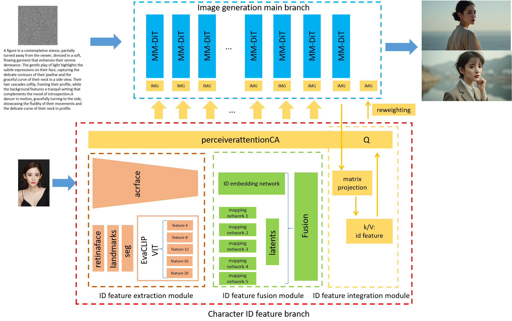

* **PuLID: Pure and Lightning ID Customization via Contrastive Alignment**
  
  * 地址：https://github.com/ToTheBeginning/PuLID   
  * 架构图：
  
   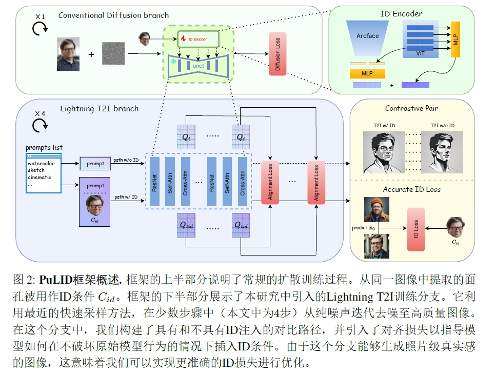
  
* **FLUX-customID: Realistically Customize Your Personal ID to Perfection**
  
  * 地址：https://github.com/damo-cv/FLUX-customID     
  * [comfyui](https://github.com/leeguandong/ComfyUI_FluxCustomId)：
  
   
  
* **Identity-Preserving Text-to-Video Generation by Frequency Decomposition**
  
  * 地址：https://github.com/PKU-YuanGroup/ConsisID 
  * 架构图：
  
  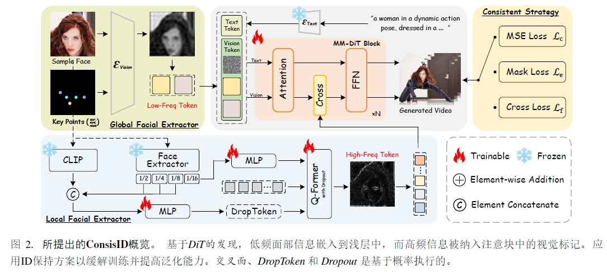

* **InfiniteYou: Flexible Photo Recrafting While Preserving Your Identity**
  
  * 地址：https://github.com/bytedance/InfiniteYou 
  * 架构图：
  
  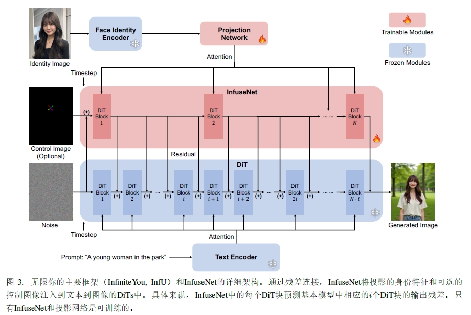

* **Less-to-More Generalization: Unlocking More Controllability by In-Context Generation**
  
  * 地址：https://github.com/bytedance/UNO 
  * 架构图：
  
  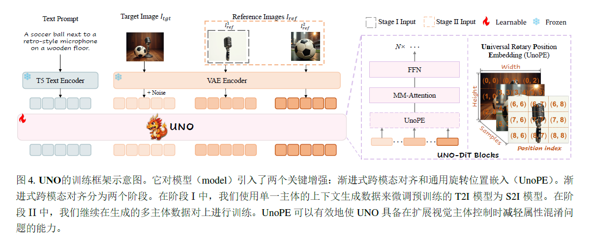

* **ACE++: Instruction-Based Image Creation and Editing via Context-Aware Content Fillingn**
  
  * 地址：https://github.com/ali-vilab/ACE_plus 
  * 架构图：
  
  

* **Personalize Anything for Free with Diffusion Transformer**
  
  * 地址：https://github.com/fenghora/personalize-anything 
  * 架构图：
  
  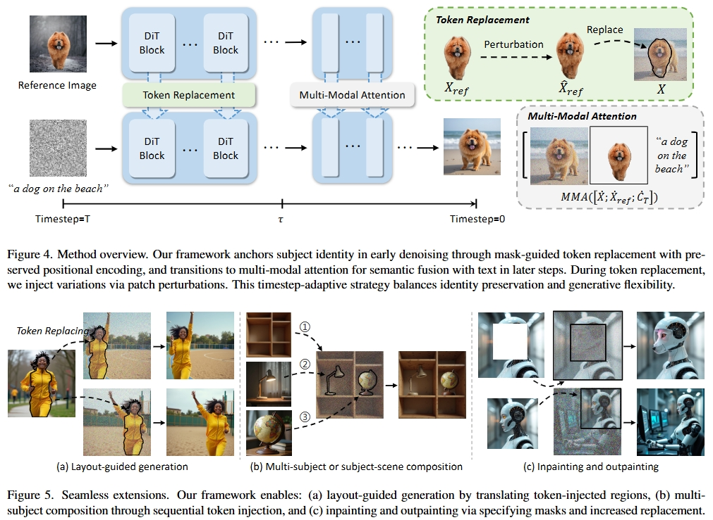

* **Large-Scale Text-to-Image Model with Inpainting is a Zero-Shot Subject-Driven Image Generator**
  
  * 地址：https://github.com/wuyou22s/Diptych 
  * 架构图：
  
  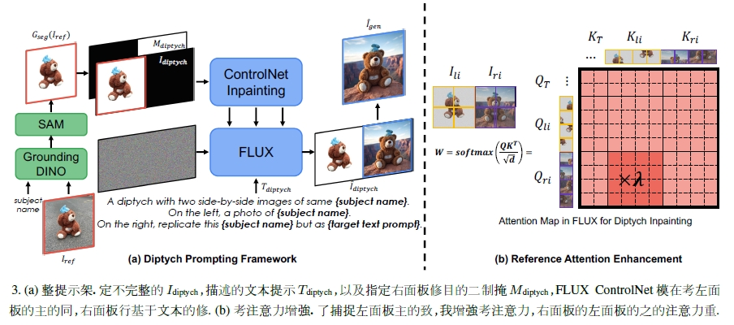

* **DynamicID: Zero-Shot Multi-ID Image Personalization with Flexible Facial Editability**
  
  * 地址：https://arxiv.org/abs/2503.06505
  * 架构图：
  
  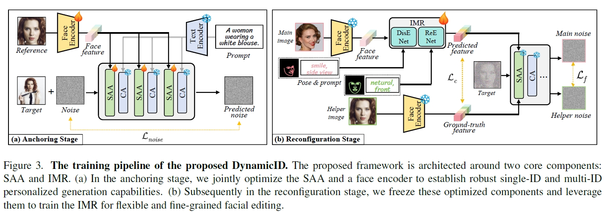

* **InstantCharacter: Personalize Any Characters with a Scalable Diffusion Transformer Framework**
  
  * 地址：https://github.com/Tencent/InstantCharacter 
  * 架构图：
  
  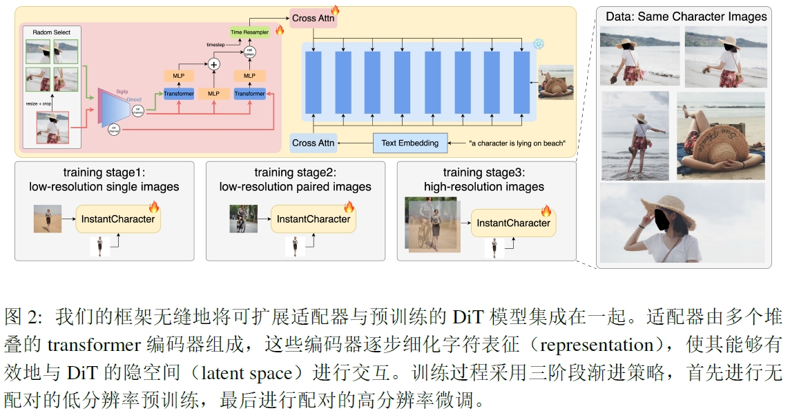

* **RealCustom++: Representing Images as Real Text Word for Real-Time Customization**
  
  * 地址：https://github.com/bytedance/RealCustom 
  * 架构图：
  
  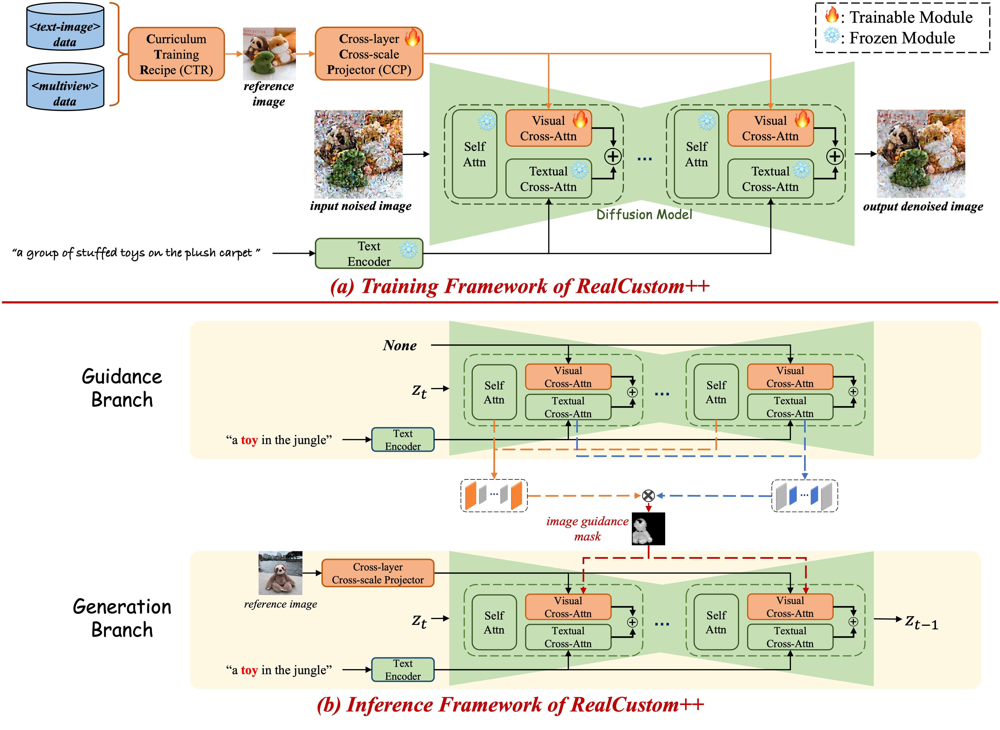

* **DreamO: A Unified Framework for Image Customization**
  
  * 地址：https://github.com/bytedance/DreamO 
  * 架构图：
  
  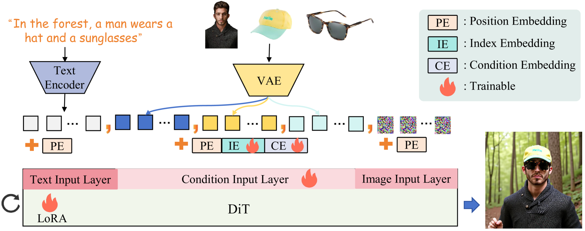

* **FlexIP: Dynamic Control of Preservation and Personality for Customized Image Generation**
  
  * 地址：https://arxiv.org/abs/2504.07405
  * 架构图：
  
  

#### 1.2 Unet模型

* **PortraitBooth: A Versatile Portrait Model for Fast Identity-preserved Personalization**
  
  * 地址：https://portraitbooth.github.io/
  * 架构图：
  
  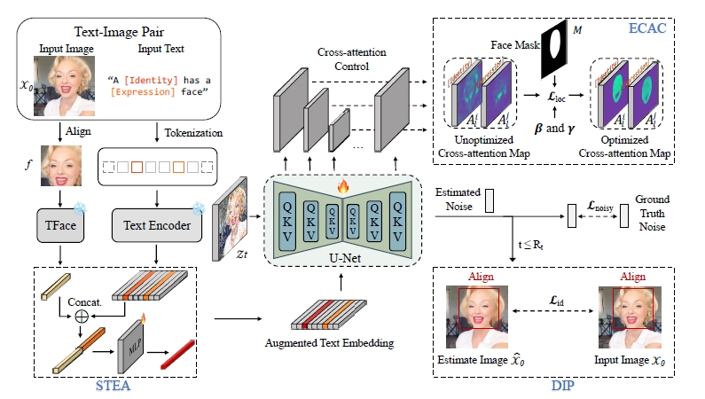
  
* **DreamIdentity: Improved Editability for Efficient Face-identity Preserved Image Generation**
  
  * 地址：https://arxiv.org/abs/2307.00300
  * 架构图：
  
  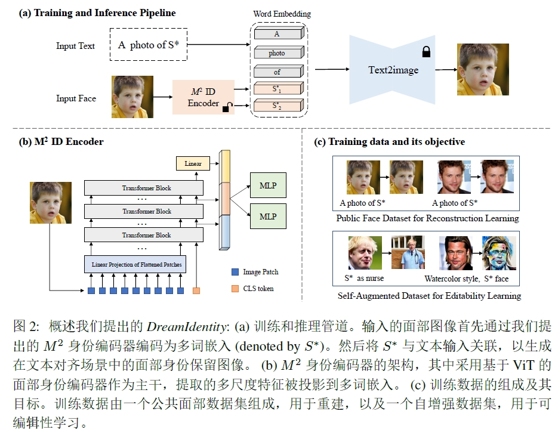
  
* **ConsistentID : Portrait Generation with Multimodal Fine-Grained Identity Preserving**
  
  * 地址：https://github.com/JackAILab/ConsistentID   
  * 架构图：
  
  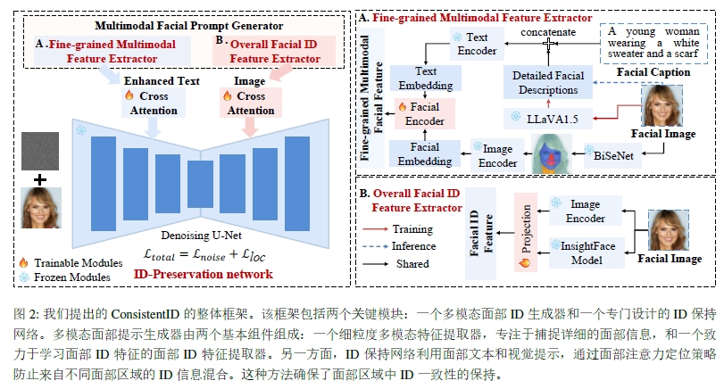
  
* **PhotoMaker: Customizing Realistic Human Photos via Stacked ID Embedding**

  * 地址：https://github.com/TencentARC/PhotoMaker 
  * 架构图：

  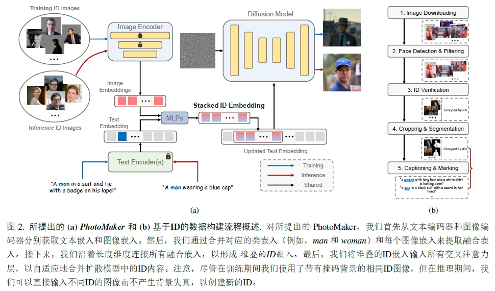

* **IDAdapter: Learning Mixed Features for Tuning-Free Personalization of Text-to-Image Models**

  * 地址：https://arxiv.org/abs/2403.13535
  * 架构图：

  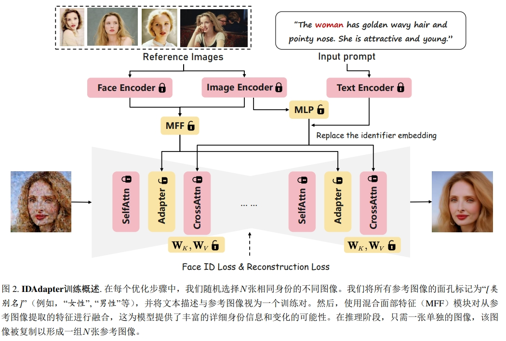

* **InstantID: Zero-shot Identity-Preserving Generation in Seconds**

  * 地址：https://github.com/instantX-research/InstantID 
  * 架构图：

  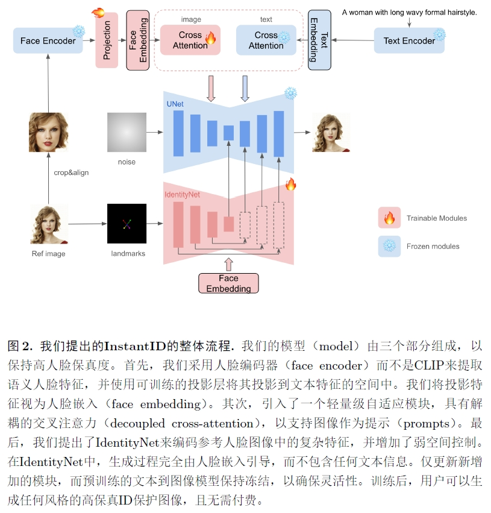
  
* **Character-Adapter: Prompt-Guided Region Control for High-Fidelity Character Customization**

  * 地址：https://github.com/Character-Adapter/Character-Adapter 
  * 架构图：

  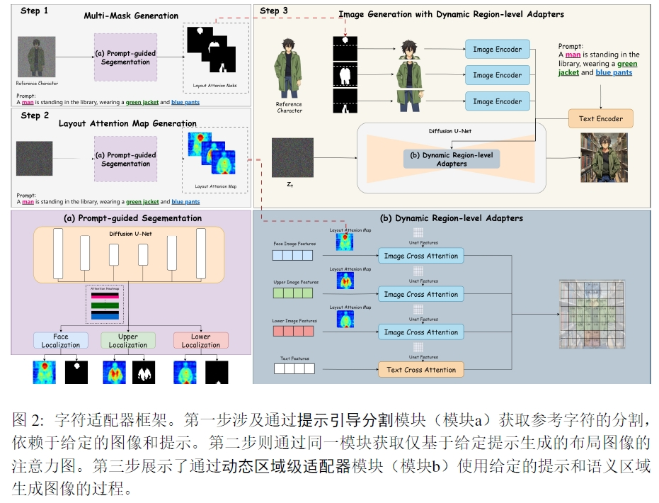

* **Face Adapter for Pre-Trained Diffusion Models with Fine-Grained ID and Attribute Control**

  * 地址：https://github.com/FaceAdapter/Face-Adapter 
  * 架构图：

  

* **FastComposer: Tuning-Free Multi-Subject Image Generation with Localized Attention**

  * 地址：https://github.com/open-mmlab/mmagic/tree/main/configs/fastcomposer 
  * 架构图：

  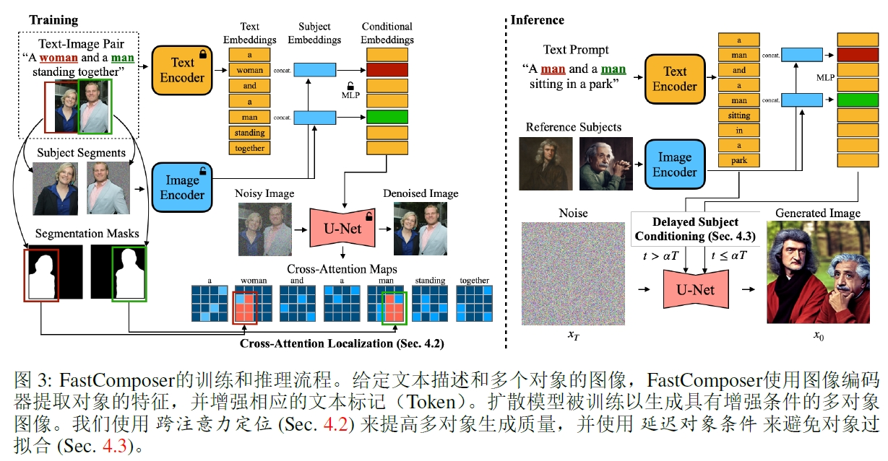

* **IC-Portrait: In-Context Matching for View-Consistent Personalized Portrait Generation**

  * 地址：https://arxiv.org/abs/2501.17159
  * 架构图：

  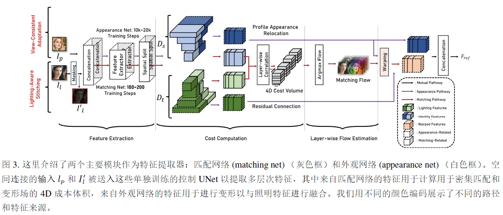

* **MasterWeaver: Taming Editability and Identity for Personalized Text-to-Image Generation**

  * 地址：https://github.com/csyxwei/MasterWeaver 
  * 架构图：

  

* **PhotoVerse: Tuning-Free Image Customization with Text-to-Image Diffusion Models**

  * 地址：https://github.com/idonahum/photoVerse 
  * 架构图：

  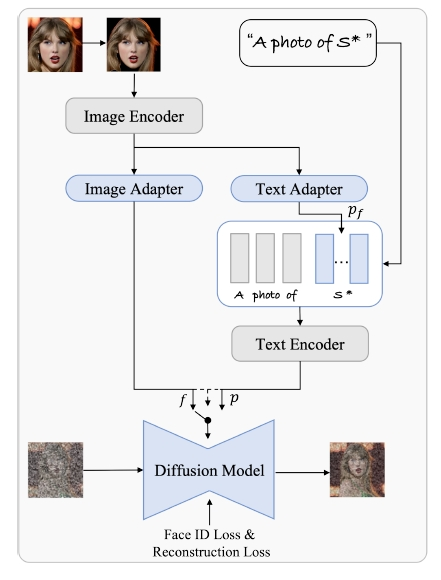

* **UniPortrait: A Unified Framework for Identity-Preserving Single- and Multi-Human Image Personalization**

  * 地址：https://github.com/junjiehe96/UniPortrait 
  * 架构图：

  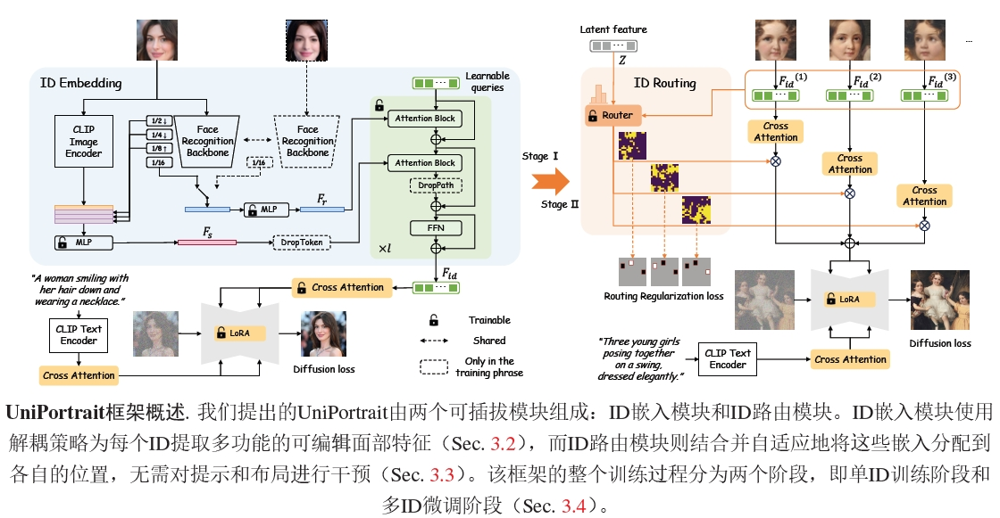

* **RealisID: Scale-Robust and Fine-Controllable Identity Customization via Local and Global Complementation**

  * 地址：https://arxiv.org/abs/2412.16832
  * 架构图：

  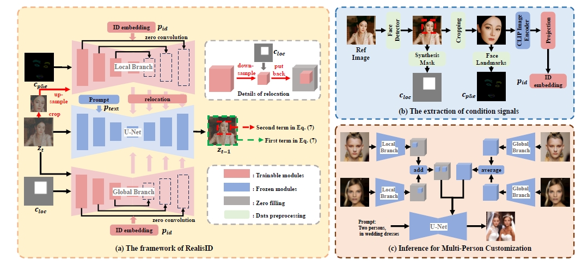

* **FlashFace: Human Image Personalization with High-fidelity Identity Preservation**

  * 地址：https://github.com/ali-vilab/FlashFace 
  * 架构图：

  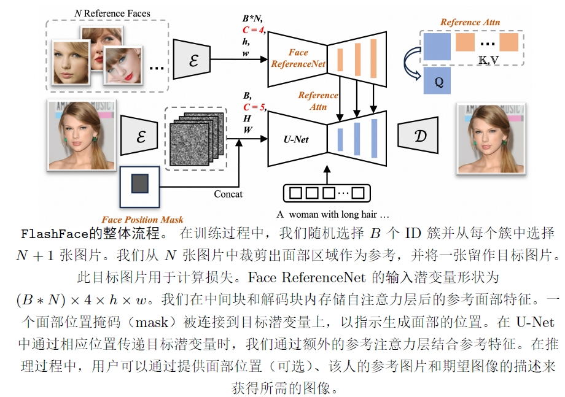

* **Turn That Frown Upside Down:FaceID Customization via Cross-Training Data**

  * 地址：https://github.com/ShuheSH/CrossFaceID 
  * 架构图：

  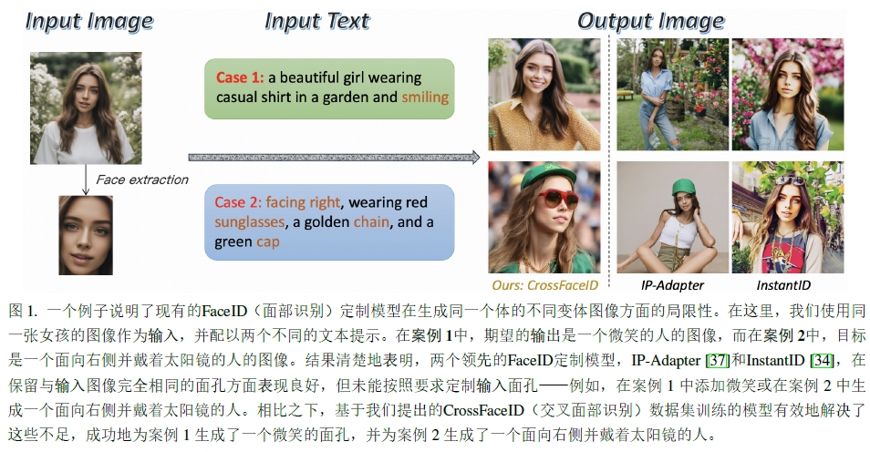

* **DreamID: High-Fidelity and Fast diffusion-based Face Swapping via Triplet ID Group Learning**

  * 地址：https://github.com/superhero-7/DreamID 
  * 架构图：

  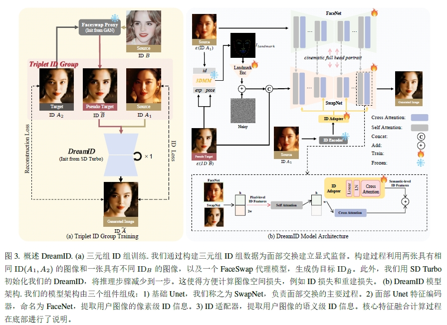

* **ID-Booth: Identity-consistent Face Generation with Diffusion Models**

  * 地址：https://github.com/dariant/ID-Booth 
  * 架构图：
  
  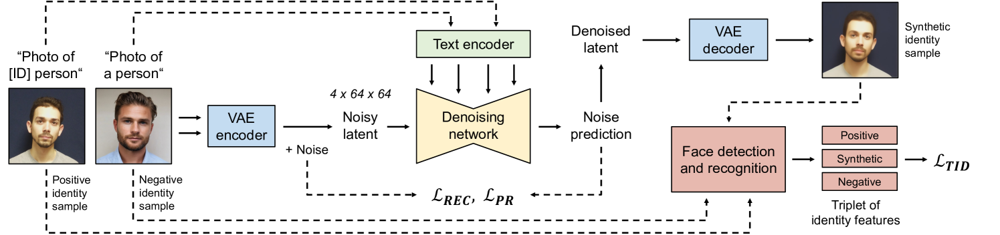

###  2. 测评

###  3. 数据集

## Star History

<a href="https://star-history.com/#leeguandong/Awesome-ID-Customization&Date">

  <picture>
    <source media="(prefers-color-scheme: dark)" srcset="https://api.star-history.com/svg?repos=leeguandong/Awesome-ID-Customization&type=Date&theme=dark" />
    <source media="(prefers-color-scheme: light)" srcset="https://api.star-history.com/svg?repos=leeguandong/Awesome-ID-Customization&type=Date" />
    
  </picture>
</a>
